<h1 align="center">
  
</h1>

<h3 align="center">Aspiring DevOps & Cloud Engineer | Building the Future with Automation</h3>

<p align="center">
  <a href="mailto:sakitazeyek@gmail.com"></a>
  <a href="https://github.com/Mr-Sakit"></a>
  <a href="https://www.linkedin.com/in/sakit-babazad%C9%99/"></a>
</p>

<p align="center">
  
</p>

---

## 🧑‍💻 About Me

```yaml
name: Sakit Babazadə
location: Azerbaijan 🇦🇿
current_focus: DevOps & Cloud Engineering Bootcamp
interests:
  - Cloud Infrastructure & Architecture
  - CI/CD Pipeline Automation
  - Containerization & Orchestration
  - Infrastructure as Code
  - Monitoring & Observability
motto: "Automate everything, learn by doing."
```

I'm a passionate and hands-on aspiring **DevOps Engineer** currently completing an intensive bootcamp covering the full DevOps lifecycle — from provisioning cloud infrastructure on **Azure** to building **CI/CD pipelines**, containerizing workloads with **Docker**, writing **Infrastructure as Code** with **Terraform**, and implementing **DevSecOps** practices. I believe in learning by building real-world projects and documenting every step of the journey.

---

## 🚀 What I'm Working On

<table>
  <tr>
    <td align="center" width="50%">
      <h3>🎓 DevOps Bootcamp</h3>
      <p>
        <a href="https://github.com/Mr-Sakit/DevOpsFirstStep">
          
        </a>
      </p>
      <p><strong>48+ Hands-On Labs</strong> across <strong>9 Weeks</strong></p>
      <p><strong>81 Commits</strong> &nbsp;|&nbsp; Actively Learning</p>
      <p>A comprehensive, documented collection of labs, projects, and practical assignments covering the entire DevOps & Cloud Engineering stack.</p>
    </td>
    <td align="center" width="50%">
      <h3>🏗️ Project: 3-Tier Azure Deployment</h3>
      <p>
        <a href="https://github.com/Mr-Sakit/DevOpsFirstStep/tree/main/week6/project-1">
          
        </a>
      </p>
      <p>Secure, scalable e-commerce app on Azure</p>
      <p>React + Node.js + Azure SQL</p>
      <p>App Gateway · VNet · Private Endpoints · NSGs · Autoscaling · Alert Rules</p>
    </td>
  </tr>
</table>

---

## 🛠️ Tech Stack & Tools

<details open>
<summary><b>☁️ Cloud & Infrastructure</b></summary>
<br>
<p>
  
  
  
  
  
</p>
</details>

<details open>
<summary><b>🏗️ Infrastructure as Code</b></summary>
<br>
<p>
  
  
</p>
</details>

<details open>
<summary><b>🐳 Containers & Orchestration</b></summary>
<br>
<p>
  
  
  
  
</p>
</details>

<details open>
<summary><b>⚙️ CI/CD & DevSecOps</b></summary>
<br>
<p>
  
  
</p>
</details>

<details open>
<summary><b>🐧 OS, Scripting & Version Control</b></summary>
<br>
<p>
  
  
  
  
  
  
  
</p>
</details>

<details open>
<summary><b>🌐 Web Servers & Application Runtimes</b></summary>
<br>
<p>
  
  
  
</p>
</details>

---

## 📊 Bootcamp Progress

```
Week 1  ██████████████████████████████  DevOps Foundations, Agile & Git         ✅
Week 2  ██████████████████████████████  Linux, Shell Scripting & Web Servers    ✅
Week 3  ██████████████████████████████  Azure Cloud Computing                  ✅
Week 4  ██████████████████████████████  Azure CLI, Auto Scaling & Docker       ✅
Week 5  ██████████████████████████████  Docker Advanced (Compose, Multi-stage) ✅
Week 6  ██████████████████████████████  Project 1: 3-Tier Azure Deployment     ✅
Week 7  ██████████████████████████████  CI/CD with GitHub Actions              ✅
Week 8  ██████████████████████████████  DevSecOps, CD & Terraform              ✅
Week 9  ████████░░░░░░░░░░░░░░░░░░░░░░  Terraform Modules (In Progress)       🔄
```

<details>
<summary><b>📋 Detailed Lab Breakdown (click to expand)</b></summary>
<br>

| Week | Focus Area | Labs | Key Topics |
|:----:|:-----------|:----:|:-----------|
| **1** | DevOps Foundations | 5 | Agile, Scrum, Azure DevOps Boards, Git basics |
| **2** | Linux & Scripting | 13 | Git branching, Linux VM, file permissions, Vim, Apache, Nginx, Bash |
| **3** | Azure Cloud | 9 | Windows VM, Web App, VNet, NSG, Load Balancer, App Gateway, Blob, SQL, Monitoring |
| **4** | Azure CLI & Docker | 7 | Azure CLI automation, Auto Scaling, Docker install, containerization, Azure Container Apps |
| **5** | Docker Advanced | 6 | PostgreSQL in Docker, networking, two-tier & three-tier apps, Docker Compose, multi-stage builds |
| **6** | **Project 1** | 1 | Full 3-tier e-commerce app on Azure (React + Node.js + SQL + App Gateway + VNet) |
| **7** | CI/CD | 3 | GitHub Actions workflows, Node.js CI, Maven Java CI |
| **8** | DevSecOps & IaC | 8 | SonarQube, CD to Azure Container Apps & Web App, Terraform setup, state management |
| **9** | Terraform | 1 | Reusable Terraform modules |

**Total: 48+ documented labs with step-by-step READMEs and screenshots**

</details>

---

## 🏆 Key Projects & Achievements

<table>
  <tr>
    <td>🏗️</td>
    <td><strong>3-Tier Azure E-Commerce Deployment</strong></td>
    <td>Deployed a secure, scalable React + Node.js + Azure SQL app with Application Gateway, VNet isolation, Private Endpoints, NSGs, custom autoscaling, and metric-based alerting</td>
  </tr>
  <tr>
    <td>🐳</td>
    <td><strong>Multi-Stage Docker Builds</strong></td>
    <td>Containerized Java and Node.js apps with optimized multi-stage Dockerfiles and Docker Compose orchestration</td>
  </tr>
  <tr>
    <td>⚙️</td>
    <td><strong>CI/CD Pipeline Automation</strong></td>
    <td>Built end-to-end GitHub Actions pipelines — build, test, code quality (SonarQube), and deploy to Azure Container Apps & Web App</td>
  </tr>
  <tr>
    <td>🏗️</td>
    <td><strong>Infrastructure as Code with Terraform</strong></td>
    <td>Provisioned Azure infrastructure using Terraform with remote state storage and reusable modules</td>
  </tr>
  <tr>
    <td>🐧</td>
    <td><strong>Shell Scripting Ops Toolkit</strong></td>
    <td>Built Bash scripts for file management, process monitoring, and operational automation</td>
  </tr>
</table>

---

## 📈 GitHub Stats

<p align="center">
  
  
</p>

---

## 🗺️ Learning Roadmap

```mermaid
graph LR
    A["DevOps Foundations<br/>Git · Agile · Scrum"] --> B["Linux & Scripting<br/>Bash · Vim · Web Servers"]
    B --> C["Azure Cloud<br/>VMs · Networking · Storage"]
    C --> D["Docker<br/>Compose · Multi-stage"]
    D --> E["CI/CD<br/>GitHub Actions · SonarQube"]
    E --> F["Terraform<br/>IaC · Modules · Remote State"]
    F --> G["Kubernetes<br/>AKS · Helm"]
    G --> H["Monitoring<br/>Prometheus · Grafana"]
    H --> I["GitOps<br/>ArgoCD · Flux"]

    style A fill:#10B981,stroke:#059669,color:#fff
    style B fill:#10B981,stroke:#059669,color:#fff
    style C fill:#10B981,stroke:#059669,color:#fff
    style D fill:#10B981,stroke:#059669,color:#fff
    style E fill:#10B981,stroke:#059669,color:#fff
    style F fill:#F59E0B,stroke:#D97706,color:#fff
    style G fill:#3B82F6,stroke:#2563EB,color:#fff
    style H fill:#3B82F6,stroke:#2563EB,color:#fff
    style I fill:#3B82F6,stroke:#2563EB,color:#fff
```


<p align="center">
  🟢 Completed &nbsp;&nbsp;|&nbsp;&nbsp; 🟡 In Progress &nbsp;&nbsp;|&nbsp;&nbsp; 🔵 Upcoming
</p>

---

## 🎯 Career Goals

I'm actively building my expertise toward the following roles:

- 🔧 **DevOps Engineer** — Automating software delivery and infrastructure management
- ☁️ **Cloud Engineer (Azure)** — Designing and operating scalable cloud solutions
- 🖥️ **Site Reliability Engineer (SRE)** — Ensuring system reliability and performance
- 🏗️ **Platform Engineer** — Building internal developer platforms and tooling

---

## 📫 Let's Connect

<p align="center">
  <a href="mailto:sakitazeyek@gmail.com">
    
  </a>
  &nbsp;&nbsp;
  <a href="https://github.com/Mr-Sakit">
    
  </a>
</p>

---

<p align="center">
  
</p>

<p align="center">
  <i>"Learn by doing — automate everything, document the journey."</i>
</p>
